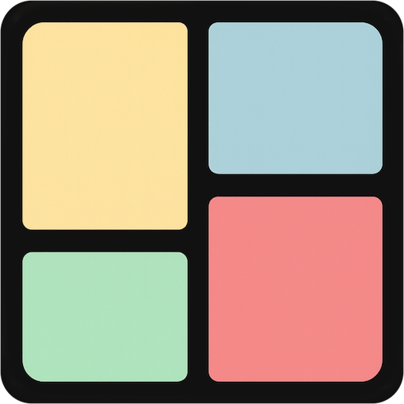
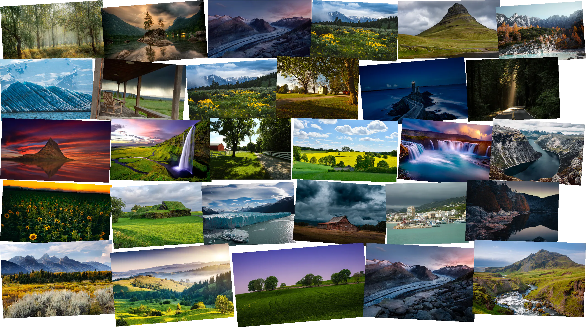
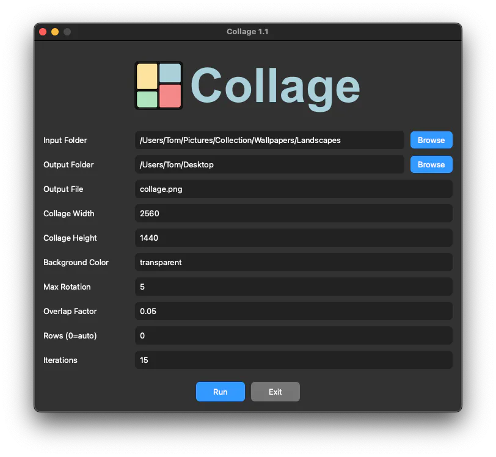

# Collage



Create **organic collages from images** – optimized space usage, minimal overlap, optional rotation, and transparent background.  

The app offers both a **Graphical User Interface (GUI)** and **CLI options**.

## Features

- Generate collages from any folder of images (.jpg, .jpeg, .png)  
- Optimized usage of the canvas with minimal overlap  
- Optional rotation of individual images  
- Transparent background support  
- GUI with intuitive input fields and easy execution  
- CLI for automated workflows  
- Flexible layout with configurable rows and iterations  

## Example



## Installation

1. **See** `bin/setup.sh`

2. **Optional:** Clone the GitHub repository
```
git clone https://github.com/mikegasche/collage.git
cd collage
```

## GUI Usage

1. **Launch the app**:
Use a bundled app for your operating system in the release section or start it by console:
```
python3 app/collage_gui.py
```

2. **Configure options**:
- **Input Folder**: Folder with images  
- **Output Folder**: Destination folder for the collage  
- **Output File**: Output filename (.png recommended)  
- **Collage Width / Height**: Canvas size  
- **Background Color**: #RRGGBB or `transparent`  
- **Max Rotation**: Maximum rotation angle  
- **Overlap Factor**: Degree of overlap  
- **Rows**: Number of rows (0 = auto)  
- **Iterations**: Number of layout variations  

3. Click **Run** to generate the collage.



## CLI Usage

```
python3 app/collage.py --input INPUT_DIR --width WIDTH --height HEIGHT --output OUTPUT_FILE [OPTIONS]
```

### Parameter

- --input INPUT_DIR : Folders with images (.jpg, .jpeg, .png)  
- --width WIDTH : Width of collage
- --height HEIGHT : Height of collage
- --output OUTPUT_FILE : Name of collage output file (.png recommended)  

### Optional Parameters

- --bgcolor BGCOLOR : Background color (#RRGGBB, R,G,B) or transparent  
- --rows N : Number of rows (0 = auto)  
- --overlap-factor F : Maximum overlap factor (default: 0.05)  
- --max-rotation DEG : Maximum rotation in degrees (default: 5)  
- --iterations N : Number of layout variations (default: 15)  

## Tips for Best Results

| Number of Images | Canvas    | Rows | Overlap   | Rotation | Iterations | Notes                                               |
| ---------------- | --------- | ---- | --------- | -------- | ---------- | -------------------------------------------------- |
| 6–8              | 2560x1440 | 2    | 0.05–0.08 | 0–5°     | 15–20      | Even upper & lower rows, minimal overlap          |
| 9–12             | 2560x1440 | 3    | 0.05–0.08 | 0–5°     | 20–25      | 3 rows, good canvas utilization                   |
| 12–20            | 2560x1440 | 3–4  | 0.05–0.1  | 0–5°     | 25–40      | Increase iterations for better optimization      |
| <6               | any       | 1–2  | 0.03–0.05 | 0–5°     | 10–15      | Single row or auto                                |

## Example Commands

1. **Standard Collage with GUI**  
   Launch the app, select input/output folders, and click **Run**.

2. **Standard Collage with CLI**:

```
python3 make_rectpack_collage.py --input ./images --width 2560 --height 1440 --output collage.png --rows 2 --overlap-factor 0.05 --max-rotation 5 --iterations 20
```

3. **Automatic layout, transparent background**:

```
python3 make_rectpack_collage.py --input ./images --width 2560 --height 1440 --output collage.png --bgcolor transparent --rows 0 --iterations 25
```

## Layout Example – 8 Images, 2 Rows

Upper row (images 1–4):

```
+-------+  +-------+  +-------+  +-------+
| Img 1 |  | Img 2 |  | Img 3 |  | Img 4 |
+-------+  +-------+  +-------+  +-------+
```

Lower row (images 5–8):

```
+-------+  +-------+  +-------+  +-------+
| Img 5 |  | Img 6 |  | Img 7 |  | Img 8 |
+-------+  +-------+  +-------+  +-------+
```

## Notes

- Rows = 0 → Automatically chooses the optimal number of rows  
- Overlap Factor → Smaller = less overlap, larger = more organic layout  
- Max Rotation → Small angles for visible images, larger for artistic effect  
- Iterations → More iterations = better layout optimization, takes longer  
- Transparent background → Supports alpha channel for layering  

## License

This project is licensed under the **MIT License**. See the [LICENSE](LICENSE) file for details.
